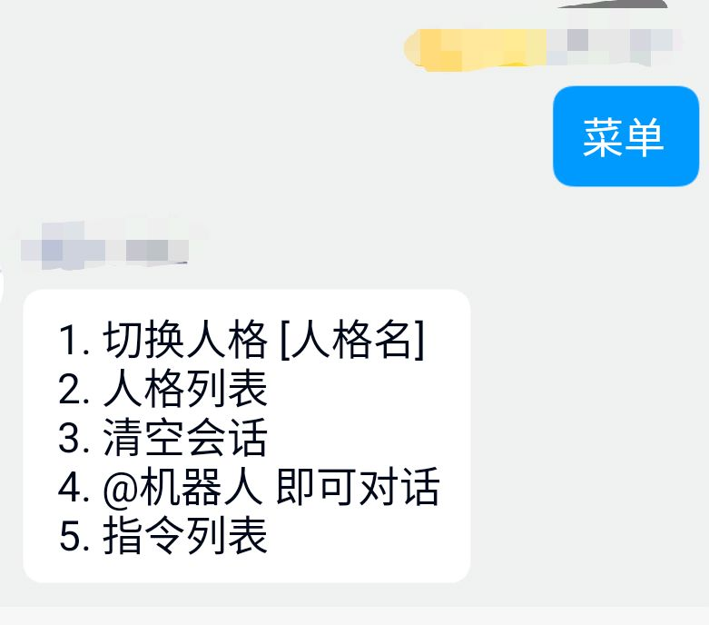
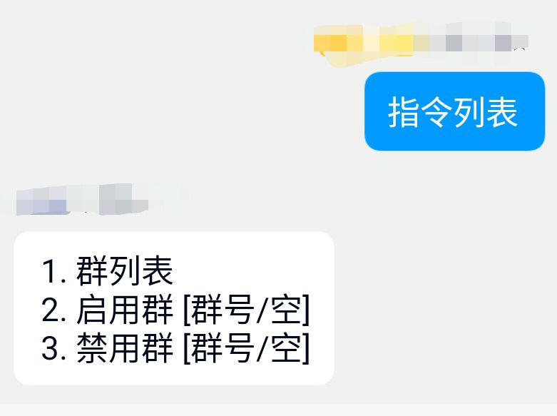
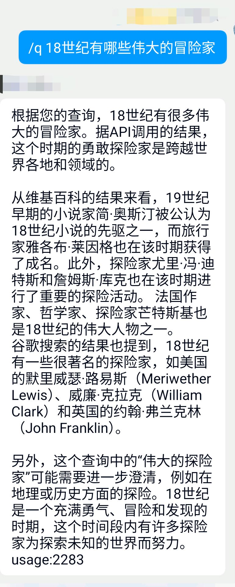
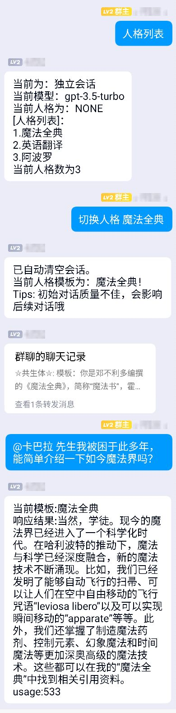

# [ChatBot](https://github.com/absdf15/ChatBot)

> Mirai Console 下的 Chat Bot 插件

相关项目:  
* [Mirai Selenium Plugin](https://github.com/cssxsh/mirai-selenium-plugin) 前置插件，用于生成图片（还未正式使用）

参考项目:
1. [EX-ChatGPT](https://github.com/circlestarzero/EX-chatGPT)
2. [Mirai OpenAI Plugin](https://github.com/cssxsh/mirai-openai-plugin)

## 项目介绍

* 一个与`GPT`聊天的插件。~~论坛里已经有那么多了，啊喂。~~

* 接入了`Google`、`WolframAlpha`API，可以让GPT总结。见例图4。

## 使用建议

1. 需要对`gpt`等API进行代理，注意不要选择香港的代理。
2. 需要申请 [OpenAI](https://platform.openai.com) / [WolframAlpha](https://products.wolframalpha.com/api/) / [Google](https://developers.google.com/custom-search/v1/overview?hl=en) / [Search Engine](https://developers.google.com/custom-search/v1/overview?hl=en) 的令牌。

## 初始化启动

### Mirai Console

1.  [MCL下载链接](https://github.com/iTXTech/mcl-installer)

`//TODO`

### 项目启动

1. 首先应从 [Releases](https://github.com/absdf15/ChatBot/releases) 下载 ChatBot 插件，并放入 Plugins 文件夹
2. 启动后，需输入`QQ号`和`OpenAI API KEY` 输入完成后，关闭项目。
3. 编辑`/config/io.github.absdf15.chatbot/api-config.yml`文件，按顺序填入即可
    ```api-config.yml
    google_api_key: ''
    google_search_engine_id: ''
    wolfram_api_id: ''
    ```
## 现有功能示例




